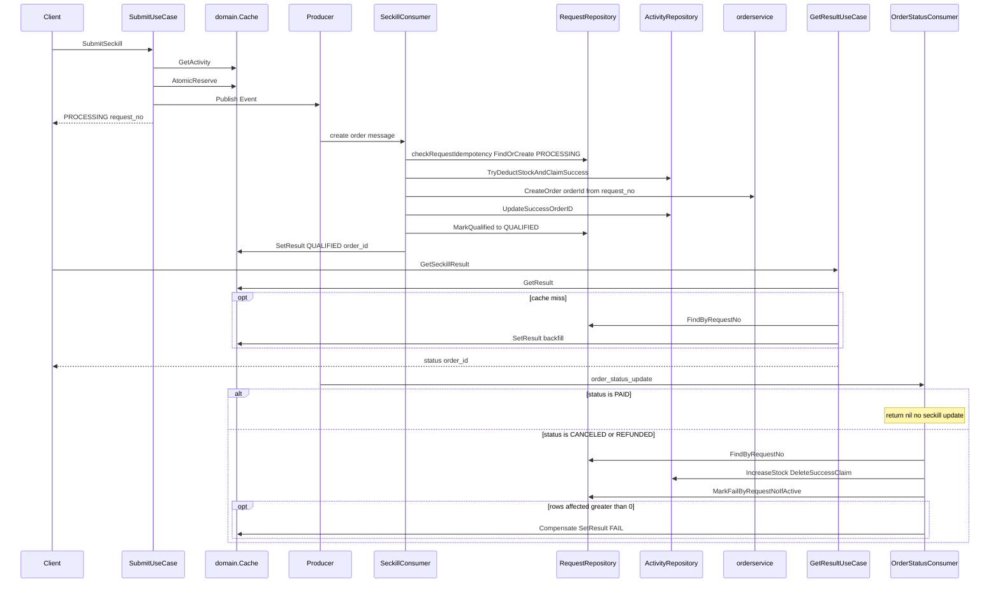

# DouyinMall
字节跳动青训营抖音电商项目，项目文档：https://ocn58gfuqyel.feishu.cn/docx/PqckduAiYo98o3xpZxOcV9C0n3c
### 秒杀流程

```mermaid  
sequenceDiagram  
participant Client  
participant Submit as SubmitUseCase  
participant Redis as domain.Cache  
participant Kafka as Producer  
participant Consumer as SeckillConsumer  
participant ReqRepo as RequestRepository  
participant ActRepo as ActivityRepository  
participant Order as orderservice  
participant GetRes as GetResultUseCase  
participant OrdCons as OrderStatusConsumer  
  
Client->>Submit: SubmitSeckill  
Submit->>Redis: GetActivity  
Submit->>Redis: AtomicReserve  
Submit->>Kafka: Publish Event  
Submit-->>Client: PROCESSING request_no  
  
Kafka->>Consumer: create order message  
Consumer->>ReqRepo: checkRequestIdempotency FindOrCreate PROCESSING  
Consumer->>ActRepo: TryDeductStockAndClaimSuccess  
Consumer->>Order: CreateOrder orderId from request_no  
Consumer->>ActRepo: UpdateSuccessOrderID  
Consumer->>ReqRepo: MarkQualified to QUALIFIED  
Consumer->>Redis: SetResult QUALIFIED order_id  
  
Client->>GetRes: GetSeckillResult  
GetRes->>Redis: GetResult  
opt cache miss  
GetRes->>ReqRepo: FindByRequestNo  
GetRes->>Redis: SetResult backfill  
end  
GetRes-->>Client: status order_id  
  
Kafka->>OrdCons: order_status_update  
alt status is PAID  
Note over OrdCons: return nil no seckill update  
else status is CANCELED or REFUNDED  
OrdCons->>ReqRepo: FindByRequestNo  
OrdCons->>ActRepo: IncreaseStock DeleteSuccessClaim  
OrdCons->>ReqRepo: MarkFailByRequestNoIfActive  
opt rows affected greater than 0  
OrdCons->>Redis: Compensate SetResult FAIL  
end  
end  
```
