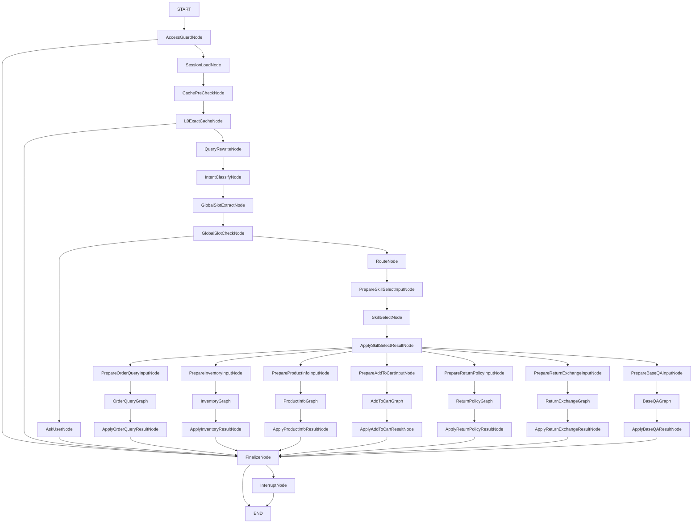
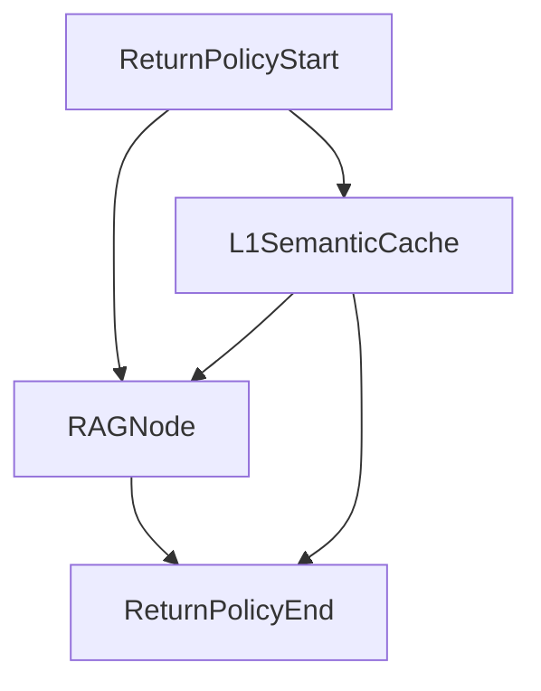
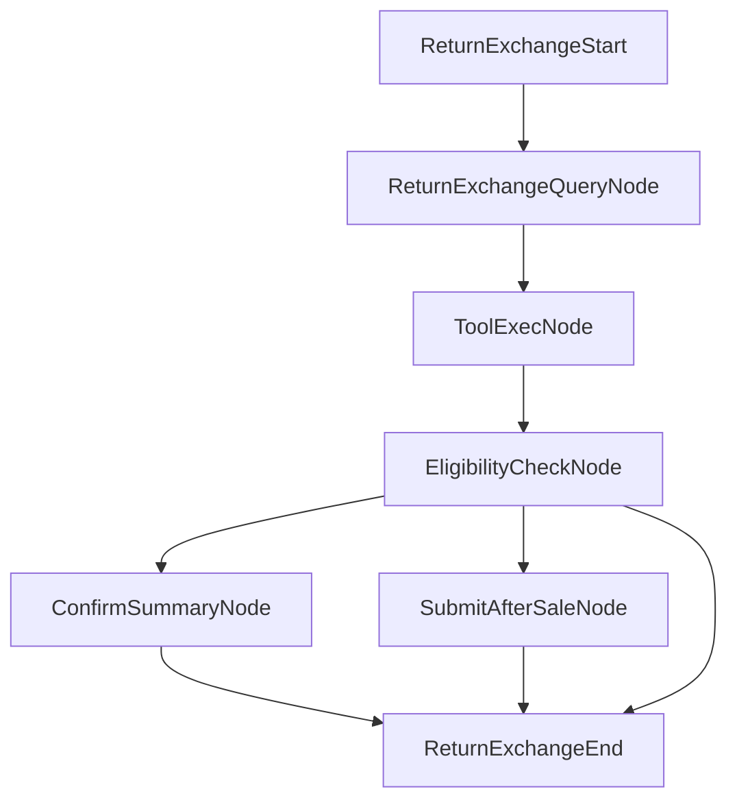
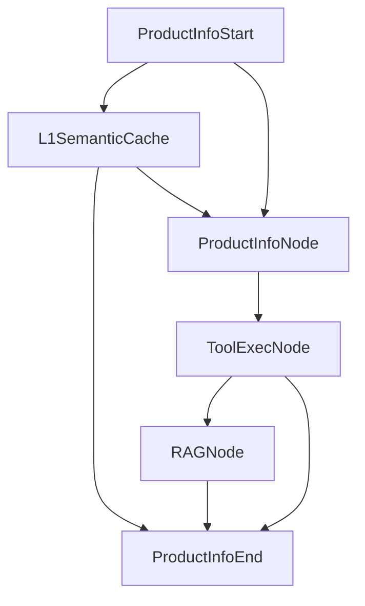
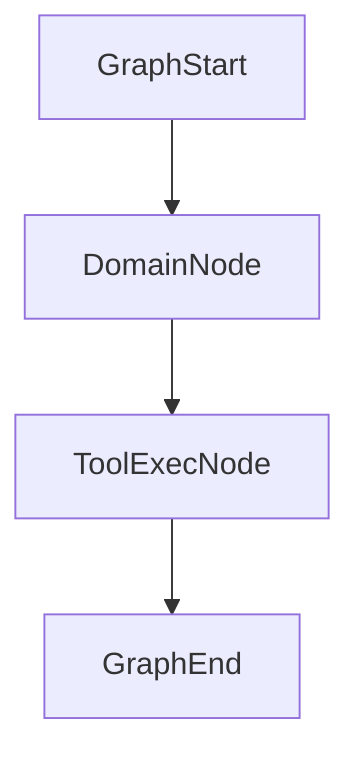
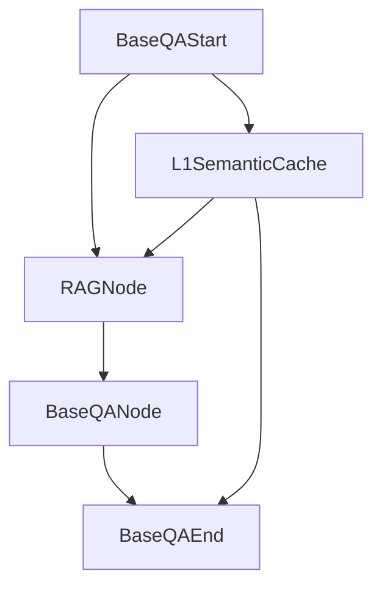

# 整体工作流

这份文档对应当前 `agent orchestrator` 的实际实现，主图以 [builder.go](/D:/workspace/go/DouyinMall/backend/internal/agent/orchestrator/graph/builder.go) 为准。

## 主流程

## 分支说明

1. `AccessGuardNode`
   有错误码时直接进入 `FinalizeNode`；正常请求进入 `SessionLoadNode`。

2. `L0ExactCacheNode`
   命中全局精确缓存时直接进入 `FinalizeNode`；未命中时进入 `QueryRewriteNode`。

3. `GlobalSlotCheckNode`
   如果当前仍缺槽位，进入 `AskUserNode`；槽位满足后进入 `RouteNode`。

4. `ApplySkillSelectResultNode`
   根据 `Route` 分发到不同业务子图：
   `OrderQueryGraph`、`InventoryGraph`、`ProductInfoGraph`、`AddToCartGraph`、`ReturnPolicyGraph`、`ReturnExchangeGraph`、`BaseQAGraph`。

5. `FinalizeNode`
   如果存在 `interrupt payload`，进入 `InterruptNode`；否则直接结束。

## 缓存位置

- 主流程只保留全局 `L0ExactCacheNode`。
- `L1SemanticCache` 不再挂在主流程入口。
- `L1SemanticCache` 放在业务子图内部，由业务自己决定是否尝试。

## 子图流转

### ReturnPolicyGraph

说明：

- 子图内部先判断是否尝试 `L1SemanticCache`。
- `L1` 命中时直接返回；未命中时继续进入 `RAGNode`。

### ReturnExchangeGraph

说明：

- 退换货申请先做查询和资格校验。
- 根据确认状态和是否可自动提交，继续走确认摘要或售后提交。

### ProductInfoGraph

说明：

- 子图内部先判断是否尝试 `L1SemanticCache`。
- 未命中时再进入商品工具和按需 RAG。

### OrderQueryGraph / InventoryGraph / AddToCartGraph

说明：

- 这三个子图结构比较直接，都是“业务节点产出计划 -> 工具执行 -> 返回结果”。

### BaseQAGraph

说明：

- 子图内部也会判断是否尝试 `L1SemanticCache`。
- 未命中时进入 `RAGNode` 和 `BaseQANode` 做兜底回答。
