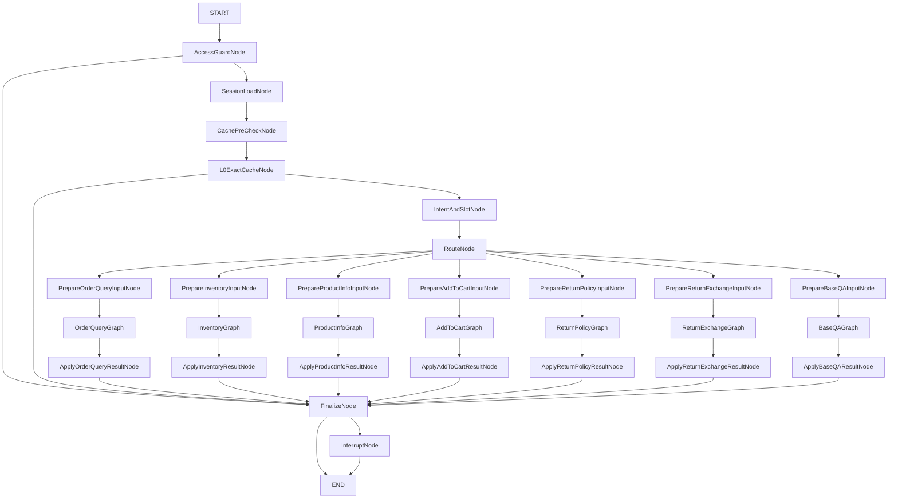

# 主图工作流

**Eino `compose.Graph` + 共享 `*domain.State`**。实现以 [builder.go](./builder.go) 为准；面试背记全文见 [docs/面试-AI客服工作流.md](../../docs/面试-AI客服工作流.md)。

---

## 原则（简表）

| 项 | 说明 |
|----|------|
| **State** | 本轮唯一运行态：`Session` / `Intent` / `Cache` / `Tool` / `Retrieval` / `Answer` / `Response` 等。 |
| **主图** | 准入 → 会话 → L0 → **意图槽位（内含槽位对齐）** → 路由 → **子图** → **Finalize**；不规定子图内部节点顺序。 |
| **子图入口** | `Prepare*Input` 仅传 `struct{}`；业务字段在子图内 **`ProcessState` 读 State**。 |
| **白名单** | `subgraph/metadata.Resolve(route)` + 各业务 `metadata/whitelist.go`。 |
| **Apply*Result** | 子图 `Output` → `State`（如 `FinalAnswer`、hydrate **Slots**、**interrupt**）。 |
| **Finalize** | 出话、组 `ChatResult`、流式、落库与缓存回写；**UsedToolNames** 来自 Recorder，**不对外带全量 ToolExecution**。 |
| **interrupt** | 缺参等 → `Finalize` 分支 `InterruptNode` + checkpoint。 |

---

## 主流程（Mermaid）

---

## 节点顺序（口述）

1. **AccessGuardNode** — 限流、租户；异常直达 Finalize。  
2. **SessionLoadNode** — 持久化会话、槽位、历史。  
3. **CachePreCheck / L0ExactCache** — 精确缓存策略与短路。  
4. **IntentAndSlotNode** — 意图与槽位；**槽位对齐（原 SlotMerge）在同节点 StatePre 内紧随意图之后执行**。  
5. **RouteNode** — `WorkflowRoute`。  
6. **Prepare* → *Graph → Apply*** — 业务子图闭环。  
7. **FinalizeNode / InterruptNode** — 出口与中断。

---

## 缓存

- **L0**：主图 `L0ExactCacheNode`。  
- **L1**：部分子图内，受 `ResolveSemanticCachePolicy` 约束。

---

## Checkpoint

主图编译时注入 `CheckpointStore`；`InterruptBefore/After` 由 `graph.Config` 配置。缺参恢复依赖 `InterruptNode` 与客户端 `ResumeToken`。
