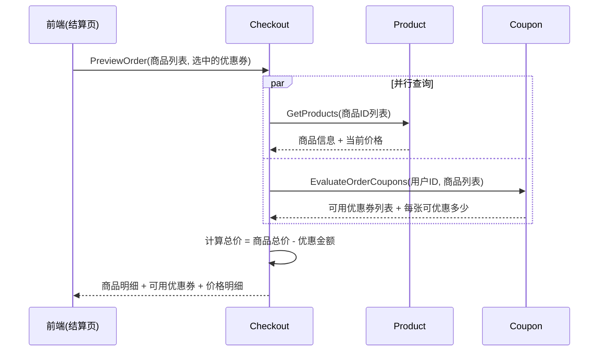
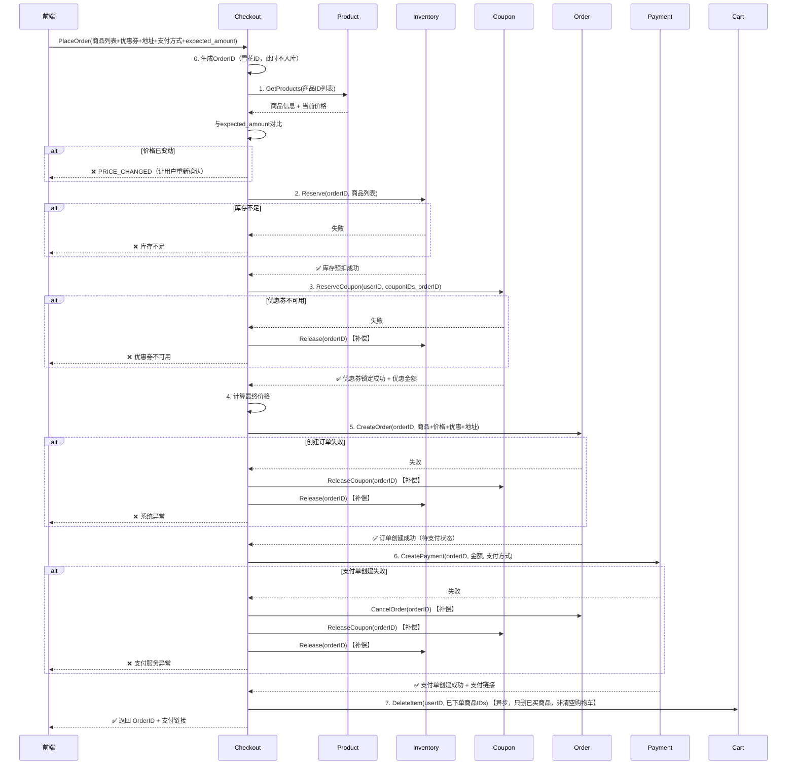

# Checkout服务设计文档

## 一、服务定位

Checkout是一个**轻量级订单提交编排服务**，负责协调多个微服务完成"结算预览"和"提交订单"两大流程。

### 职责

✅ **核心职责**：
- 结算预览：查询商品价格、评估优惠券、计算总价（给结算页用）
- 提交订单：编排预扣库存 → 锁定优惠券 → 创建订单 → 创建支付单
- Saga补偿：任何步骤失败时，自动回滚已完成的步骤

❌ **不负责**：
- 不做价格计算（Product服务提供价格，Coupon服务计算优惠）
- 不存储业务数据（无状态编排服务，不拥有数据库）
- 不管理订单生命周期（属于Order服务）

---

## 二、业务流程

### 2.1 结算页预览（PreviewOrder）

用户进入结算页时调用（**只读操作**，不创建任何资源）：

```
用户选完商品 → 进入结算页 → 调用 PreviewOrder
→ 展示：商品清单 + 价格 + 可用优惠券 + 总价
→ 用户切换优惠券 → 再次调用 PreviewOrder（重新计算总价）
```



### 2.2 提交订单（PlaceOrder）

用户确认结算页信息后，点击"提交订单"：

**核心原则：先预扣所有资源，都成功后才创建订单**



### 2.3 Saga补偿表

**正向流程**（从上到下依次执行）：

| 步骤 | 操作 | 说明 |
|------|------|------|
| 0 | 生成OrderID | 本地生成雪花ID，不入库 |
| 1 | Product.GetProducts | 查询当前价格，与 expected_amount 对比，不一致立即返回 PRICE_CHANGED |
| 2 | Inventory.Reserve | 预扣库存 |
| 3 | Coupon.ReserveCoupon | 锁定优惠券，获取优惠金额 |
| 4 | 计算最终价格 | 本地计算 |
| 5 | Order.CreateOrder | 创建订单（待支付状态） |
| 6 | Payment.CreatePayment | 创建支付单 |
| 7 | Cart.DeleteItem | 仅删除已下单的商品（非清空购物车），异步 |

**补偿流程**（任何步骤失败时，逆序回滚已完成的步骤）：

| 失败步骤 | 需要补偿的操作 |
|----------|---------------|
| 步骤2失败（库存不足） | 无需补偿（之前没有副作用） |
| 步骤3失败（优惠券不可用） | Inventory.Release |
| 步骤5失败（创建订单失败） | Coupon.Release → Inventory.Release |
| 步骤6失败（支付单失败） | Order.Cancel → Coupon.Release → Inventory.Release |

---

## 三、接口设计

### 3.1 PreviewOrder（结算预览）

用户进入结算页、切换优惠券时调用，**只读、无副作用**。

**请求参数**：
```go
type PreviewOrderReq struct {
    UserID    int64       // 用户ID
    Items     []OrderItem // 商品列表（前端传入）
    CouponIDs []int64     // 用户选中的优惠券（可选，空=不使用优惠券）
}

type OrderItem struct {
    ProductID int64 // 商品ID
    Quantity  int64 // 购买数量
}
```

**返回结果**：
```go
type PreviewOrderResp struct {
    // 商品明细
    Items          []ProductDetail   // 商品详情（名称、价格、库存状态）
    
    // 价格明细
    ProductAmount  int64             // 商品原始总价（分）
    CouponDiscount int64             // 优惠券优惠金额（分）
    TotalAmount    int64             // 应付金额（分）= 原价 - 优惠
    
    // 可用优惠券
    AvailableCoupons []CouponPreview // 该订单可用的优惠券列表
}

type ProductDetail struct {
    ProductID   int64  // 商品ID
    Name        string // 商品名称
    Price       int64  // 当前单价（分）
    Quantity    int64  // 购买数量
    Subtotal    int64  // 小计（分）
    Available   bool   // 是否可购买（在售+有库存）
    Reason      string // 不可购买原因
}

type CouponPreview struct {
    CouponID       int64  // 优惠券ID
    Name           string // 优惠券名称
    DiscountAmount int64  // 可优惠金额（分）
    Usable         bool   // 是否可用于本订单
    Reason         string // 不可用原因（未达门槛等）
}
```

### 3.2 PlaceOrder（提交订单）

用户点击"提交订单"时调用，**有副作用，需要Saga补偿**。

**请求参数**：
```go
type PlaceOrderReq struct {
    UserID        int64       // 用户ID
    Items         []OrderItem // 商品列表
    CouponIDs     []int64     // 使用的优惠券ID列表
    ShippingAddr  Address     // 收货地址
    ReceiverName  string      // 收货人姓名
    Phone         string      // 收货人电话
    PaymentMethod string      // 支付方式：wechat / alipay / card
    Remark        string      // 订单备注
    FromCart      bool        // 是否来自购物车（用于决定是否清空购物车）
}

type Address struct {
    Province string // 省
    City     string // 市
    District string // 区
    Street   string // 详细地址
    ZipCode  string // 邮编
}
```

**返回结果**：
```go
type PlaceOrderResp struct {
    OrderID     string // 订单ID
    PaymentID   string // 支付单ID
    PaymentURL  string // 支付链接（前端跳转）
    TotalAmount int64  // 应付金额（分）
    ExpireAt    int64  // 支付过期时间（Unix秒）
}
```

---

## 四、依赖的服务接口

### 4.1 Product Service
```go
// 批量查询商品信息（价格以Product服务为准，Checkout不做定价）
GetProducts(productIDs []int64) ([]Product, error)
```

### 4.2 Inventory Service
```go
// 预扣库存（用orderID关联，方便后续释放）
Reserve(orderID int64, items []InventoryItem) error

// 释放库存（补偿，幂等）
Release(orderID int64) error
```

### 4.3 Coupon Service
```go
// 评估订单可用优惠券（只读，结算页用）
EvaluateOrderCoupons(userID int64, items []OrderItem) ([]CouponEvaluation, error)

// 预扣优惠券（用orderID关联）
ReserveCoupon(userID int64, couponIDs []int64, orderID int64) (discountAmount int64, error)

// 释放优惠券（补偿，幂等）
ReleaseCoupon(orderID int64) error
```

### 4.4 Order Service
```go
// 创建订单（Checkout传入预先生成的orderID）
CreateOrder(req CreateOrderReq) error

// 取消订单（补偿，幂等）
CancelOrder(orderID int64) error
```

### 4.5 Payment Service
```go
// 创建支付单
CreatePayment(req CreatePaymentReq) (paymentID, paymentURL string, error)
```

### 4.6 Cart Service
```go
// 从购物车移除已下单的商品（异步，失败不影响主流程）
RemoveItems(userID int64, productIDs []int64) error
```

---

## 五、技术方案

### 5.1 架构分层

```
checkout/
├── domain/          # 领域层
│   ├── checkout.go  # Checkout上下文（价格计算）
│   └── error.go     # 错误定义
├── usecase/         # 用例层
│   ├── place_order.go   # 提交订单用例（Saga编排）
│   └── preview_order.go # 结算预览用例
├── client/          # RPC客户端抽象
│   ├── types.go         # 公共类型
│   ├── product.go
│   ├── inventory.go
│   ├── coupon.go
│   ├── order.go
│   ├── payment.go
│   └── cart.go
├── transport/
│   └── grpc/
│       └── handler.go
├── config/
│   ├── config.go
│   └── dev.yaml
└── ioc/
    ├── grpc.go
    ├── clients.go
    └── log.go
```

### 5.2 关键设计

#### 1. OrderID预生成

Checkout本地生成雪花ID作为OrderID，预扣资源时都带上这个ID，
最后创建订单时直接用这个ID入库。好处是：
- 预扣库存/优惠券时就有OrderID关联，方便后续补偿
- 避免"先创建订单再预扣资源"导致无效订单

#### 2. Saga补偿（defer模式）
```go
func (uc *PlaceOrderUseCase) Execute(ctx context.Context, input Input) (output Output, err error) {
    var (
        inventoryReserved bool
        couponReserved    bool
        orderCreated      bool
    )
    
    defer func() {
        if err != nil {
            // 逆序补偿
            if orderCreated {
                uc.orderClient.CancelOrder(ctx, orderID)
            }
            if couponReserved {
                uc.couponClient.ReleaseCoupon(ctx, orderID)
            }
            if inventoryReserved {
                uc.inventoryClient.Release(ctx, orderID)
            }
        }
    }()

    // 正向流程...
}
```

#### 3. 并行优化
```go
// PreviewOrder中，商品查询和优惠券评估可以并行
var g errgroup.Group
g.Go(func() error { products, err = ...; return err })
g.Go(func() error { coupons, err = ...; return err })
g.Wait()
```

---

## 六、与Order服务的区别

| 维度 | Checkout服务 | Order服务 |
|------|-------------|-----------|
| 定位 | 编排下单流程 | 订单数据管理 |
| 状态 | **无状态**（不拥有数据库） | **有状态**（存储订单） |
| 核心能力 | 流程编排 + Saga补偿 | 订单CRUD + 状态机 |
| 调用方 | 前端/BFF → Checkout | Checkout → Order | 
| 何时调用 | 用户点击"提交订单"那一瞬间 | 订单生命周期内（查询/状态变更/退款） |

**一句话区分**：
- Checkout回答"如何完成一次下单"（编排流程）
- Order回答"这个订单长什么样"（数据管理）
